# MasterFabric Serverpod

<div align="center">


[](https://github.com/gurkanfikretgunak/masterfabric_serverpod/stargazers)
[](https://github.com/gurkanfikretgunak/masterfabric_serverpod/network/members)

</div>

A production-ready full-stack Flutter application built with Serverpod, featuring rate limiting, multi-level caching, internationalization, app configuration management, authentication, and integrations with Firebase, Sentry, and Mixpanel.

## Highlights

| Feature | Description |
|---------|-------------|
| **Rate Limiting** | Distributed rate limiting with Redis, configurable per endpoint |
| **Multi-Level Caching** | Local, LocalPrio, and Global (Redis) caching strategies |
| **Internationalization** | Auto-seeding translations (EN, TR, DE) with runtime locale switching |
| **Modern Error Handling** | SerializableExceptions with detailed error responses |
| **Health Monitoring** | Real-time service health checks with auto-refresh |
| **Service Testing** | Built-in test UI for API, Auth, and Rate Limit testing |
| **Beautiful Flutter UI** | Rate limit banners, health indicators, countdown timers |
| **Authentication** | Email/password auth with JWT tokens and session management |
| **Integrations** | Firebase, Sentry, Mixpanel (configurable) |

## Quick Start

### One Command Development

```bash
# Full stack with Flutter web (default)
./dev.sh

# Full stack with specific platform
./dev.sh --ios        # iOS Simulator
./dev.sh --android    # Android Emulator
./dev.sh --macos      # macOS Desktop
./dev.sh --web        # Chrome/Web (default)

# Server only (no Flutter)
./dev.sh --no-flutter
./dev-server.sh
```

This will:
1. **Check prerequisites** (Docker, Dart, Flutter, Serverpod CLI)
2. **Start Docker** services (PostgreSQL + Redis)
3. **Generate** Serverpod code
4. **Run** the server with clean logs
5. **Launch** Flutter app (dev.sh only)

### Manual Setup

```bash
# 1. Start Docker services
cd masterfabric_serverpod_server
docker compose up -d

# 2. Install dependencies
dart pub get

# 3. Generate code
serverpod generate

# 4. Run server
dart run bin/main.dart

# 5. Run Flutter (in another terminal)
cd ../masterfabric_serverpod_flutter
flutter run
```

## Development Scripts

| Script | Location | Description |
|--------|----------|-------------|
| `dev.sh` | Root | Full stack development (Docker + Server + Flutter) |
| `dev-server.sh` | Root | Server only development (Docker + Server) |
| `run_clean.sh` | `server/bin/` | Run server with filtered logs (no stack traces) |

### `./dev.sh` - Full Stack Development

The main development script that sets up everything automatically.

**Platform Flags:**

| Flag | Short | Description |
|------|-------|-------------|
| `--web` | `-w` | Run Flutter on Chrome/Web (default) |
| `--ios` | `-i` | Run Flutter on iOS Simulator |
| `--android` | `-a` | Run Flutter on Android Emulator |
| `--macos` | `-m` | Run Flutter on macOS Desktop |
| `--no-flutter` | `-n` | Run server only (no Flutter) |
| `--help` | `-h` | Show help message |

**Examples:**

```bash
./dev.sh              # Default: web
./dev.sh --ios        # iOS Simulator
./dev.sh -a           # Android Emulator  
./dev.sh --no-flutter # Server only
```

**Output:**

```
╔═══════════════════════════════════════════════════════════════════════╗
║   MasterFabric Serverpod                                              ║
║   Local Development Environment                                        ║
╚═══════════════════════════════════════════════════════════════════════╝

[0] Checking prerequisites...
  ✓ Docker is installed
  ✓ Dart: Dart SDK version: 3.8.0
  ✓ Flutter: Flutter 3.32.0
  ✓ Serverpod CLI is installed

[1] 🐳 Starting Docker services...
  ✓ PostgreSQL is ready on port 8090
  ✓ Redis is ready on port 8091

[2] 🔧 Installing dependencies & generating code...
  ✓ Serverpod code generated

[3] 🖥 Starting Serverpod server...
  ✓ Server running at http://localhost:8080

[4] 📱 Starting Flutter app...
```

**Features:**
- Automatic prerequisite checking
- Docker container management (starts if needed, skips if running)
- Waits for services to be ready before proceeding
- Clean colored terminal output
- Graceful shutdown with `Ctrl+C`

### `./dev-server.sh` - Server Only Development

Lightweight script for backend-only development:

```bash
./dev-server.sh
```

**Use when:**
- Working on backend/API changes
- Testing endpoints with Postman/Insomnia
- Running integration tests
- Don't need the Flutter app

### Clean Logs

The scripts filter out noisy Dart async stack traces for cleaner output:

**Before (default Serverpod logs):**
```
ERROR          RateLimitException(message: Rate limit exceeded...)
STACK TRACE    #0      RateLimitService.checkLimit (package:...)
<asynchronous suspension>
#1      GreetingEndpoint.hello (package:...)
<asynchronous suspension>
```

**After (with dev scripts):**
```
⚡ RATE LIMITED │ greeting/hello │ 21/20 requests │ retry in 38s
ERROR          RateLimitException(message: Rate limit exceeded...)
```

### Services & Ports

| Service | Port | Description |
|---------|------|-------------|
| PostgreSQL | 8090 | Database |
| Redis | 8091 | Cache & Rate Limiting |
| API Server | 8080 | Main API endpoint |
| Insights | 8081 | Serverpod Insights dashboard |
| Web Server | 8082 | Static files & Flutter web |

### Stopping Services

```bash
# Stop dev script (Ctrl+C stops server & Flutter)
# Docker containers keep running for quick restart

# To fully stop Docker:
cd masterfabric_serverpod_server
docker compose down

# To stop and remove volumes (fresh start):
docker compose down -v
```

## Overview

This is a monorepo containing three main components:

- **masterfabric_serverpod_client**: Serverpod client package (generated code)
- **masterfabric_serverpod_flutter**: Flutter mobile/web application
- **masterfabric_serverpod_server**: Serverpod backend server with core services

## Architecture

### Project Structure

```
masterfabric_serverpod/
├── masterfabric_serverpod_client/    # Client package (shared between Flutter app and server)
├── masterfabric_serverpod_flutter/   # Flutter application
└── masterfabric_serverpod_server/    # Serverpod backend server
```

### Component Architecture

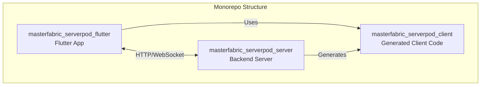

### System Architecture

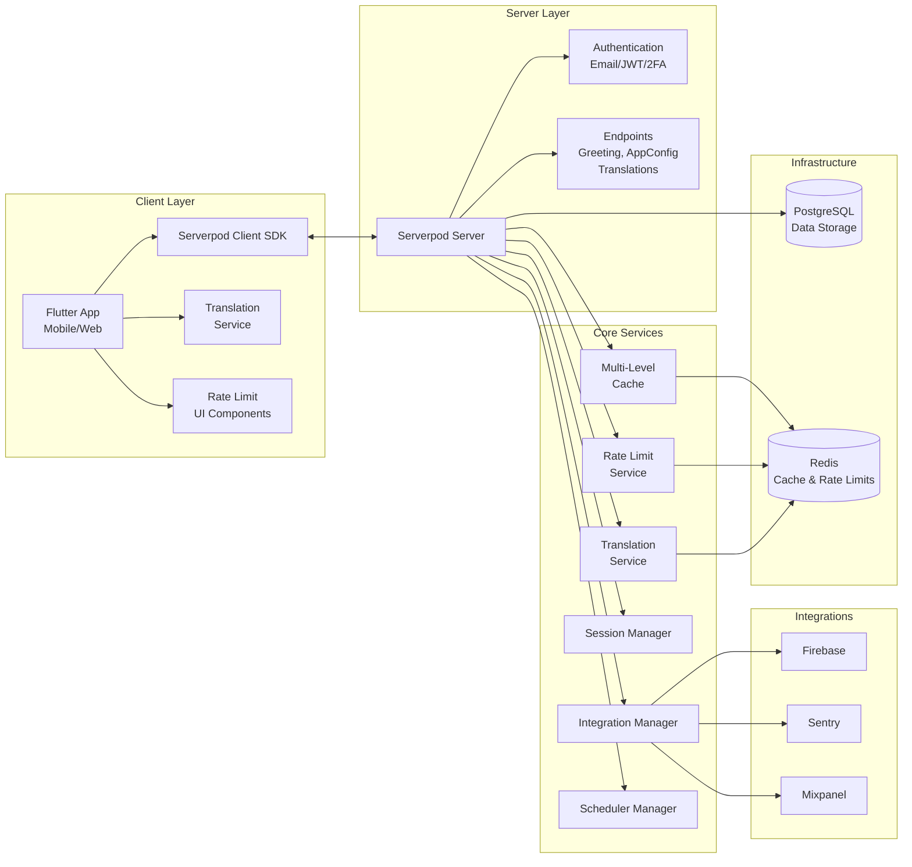

## Prerequisites

- **Dart SDK**: `^3.8.0`
- **Flutter SDK**: `^3.32.0`
- **Docker** and **Docker Compose** (for PostgreSQL and Redis)
- **Serverpod CLI**: `3.2.3`

## Getting Started

### Setup Flow


### 1. Install Dependencies

Install dependencies for all packages:

```bash
# Install server dependencies
cd masterfabric_serverpod_server
dart pub get

# Install client dependencies
cd ../masterfabric_serverpod_client
dart pub get

# Install Flutter dependencies
cd ../masterfabric_serverpod_flutter
flutter pub get
```

### 2. Start Infrastructure

Start PostgreSQL and Redis using Docker Compose:

```bash
cd masterfabric_serverpod_server
docker compose up --build --detach
```

### 3. Generate Serverpod Code

Generate the Serverpod client code:

```bash
cd masterfabric_serverpod_server
dart pub global activate serverpod_cli 3.2.3
serverpod generate
```

### 4. Seed App Configuration (Optional)

Seed initial app configuration data:

```bash
cd masterfabric_serverpod_server
serverpod run seed-app-config
```

### 5. Start the Server

Start the Serverpod server:

```bash
cd masterfabric_serverpod_server
dart bin/main.dart
# Or use the start script which applies migrations:
serverpod run start
```

### 6. Run the Flutter App

In a new terminal:

```bash
cd masterfabric_serverpod_flutter
flutter run
```

## Project Structure

### Server (`masterfabric_serverpod_server`)

```
lib/src/
├── core/
│   ├── errors/           # Custom error types (ValidationError, etc.)
│   ├── exceptions/       # SerializableExceptions (RateLimitException)
│   ├── integrations/     # Firebase, Sentry, Mixpanel
│   ├── logging/          # Structured logging
│   ├── rate_limit/       # Rate limiting service
│   ├── session/          # Session management
│   └── utils/            # Common utilities
├── services/
│   ├── app_config/       # App configuration service
│   ├── auth/             # Authentication services
│   ├── greetings/        # Example greeting endpoint
│   └── translations/     # i18n translation service
└── generated/            # Serverpod generated code
```

- **Core Services**:
  - `RateLimitService`: Distributed rate limiting with Redis
  - `TranslationService`: i18n with auto-seeding from JSON files
  - `SessionManager`: Manages user sessions with configurable TTL
  - `IntegrationManager`: Manages integrations (Firebase, Sentry, Mixpanel)
  - `SchedulerManager`: Handles cron-based scheduled tasks

- **Features**:
  - **Rate Limiting**: Per-endpoint configurable limits with Redis
  - **Caching**: LocalPrio → Local → Global (Redis) strategy
  - **Translations**: Auto-seed from `assets/i18n/*.json`
  - **App Configuration**: Centralized settings, feature flags
  - **Authentication**: Email/password with JWT tokens, 2FA
  - **Integrations**: Firebase, Sentry, Mixpanel (configurable)

- **Endpoints**:
  - `GreetingEndpoint`: Example with rate limiting & caching
  - `AppConfigEndpoint`: App configuration management
  - `TranslationEndpoint`: Translation retrieval & management

### Client (`masterfabric_serverpod_client`)

Generated client code that provides:
- Protocol definitions
- Endpoint clients
- App configuration models
- **SerializableExceptions** (RateLimitException, etc.)

### Flutter App (`masterfabric_serverpod_flutter`)

```
lib/
├── main.dart                 # App entry point with bootstrap
├── screens/
│   ├── home_screen.dart          # Dashboard with health status
│   ├── service_test_screen.dart  # Service testing (API, Auth, Rate Limit)
│   ├── greetings_screen.dart     # Greeting screen with rate limit UI
│   └── sign_in_screen.dart       # Email authentication screen
├── services/
│   ├── app_config_service.dart    # App config client
│   ├── health_service.dart        # Health monitoring service
│   └── translation_service.dart   # i18n client with locale switching
└── widgets/
    ├── health_status_bar.dart     # Health indicator & status card
    └── rate_limit_banner.dart     # Rate limit UI components
```

**Features**:
- **Email Sign-in** with verification
- **Health Monitoring** with auto-check (configurable interval)
- **Service Testing** screen (API, Auth, Rate Limit tabs)
- Rate limit banner with countdown timer
- Rate limit indicator showing remaining requests
- Modern greeting result cards
- Locale switching at runtime (EN, TR, DE)
- Loading states & error handling

## Available Scripts

### Server Scripts

Run scripts using `serverpod run <script-name>`:

- **`start`**: Starts the server and applies migrations
- **`seed-app-config`**: Seeds initial app configuration data
- **`flutter_build`**: Builds the Flutter web app and copies it to the server's web directory

Example:
```bash
cd masterfabric_serverpod_server
serverpod run start
```

## Development Workflow

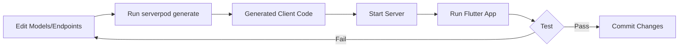

1. **Make changes** to your models/endpoints in the server
2. **Generate code**: Run `serverpod generate` in the server directory
3. **Test locally**: Start the server and run the Flutter app
4. **Commit changes**: The generated code will be committed to version control

## Key Features

### Rate Limiting

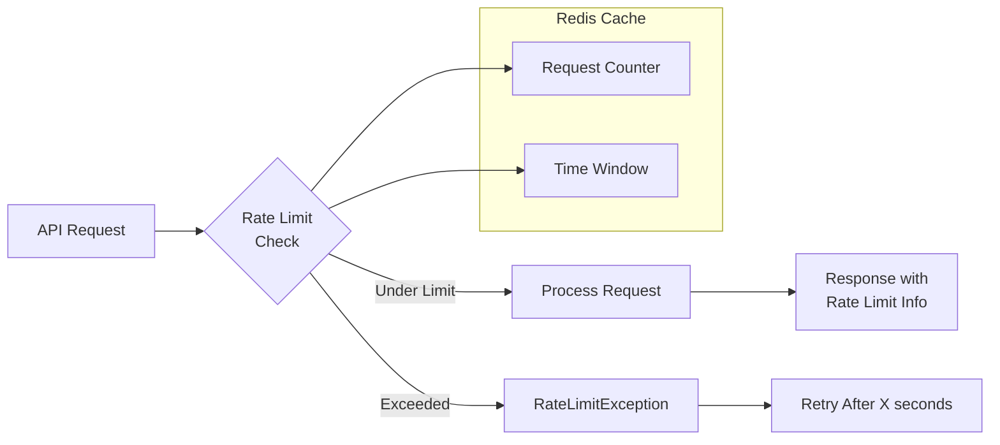

**Server-side rate limiting with Redis:**

```dart
// Configure rate limit per endpoint
static const _rateLimitConfig = RateLimitConfig(
  maxRequests: 20,           // Max requests allowed
  windowDuration: Duration(minutes: 1),  // Time window
  keyPrefix: 'greeting',     // Cache key prefix
);

// Check rate limit (throws RateLimitException if exceeded)
await RateLimitService.checkLimit(session, _rateLimitConfig, identifier);
```

**Response includes rate limit info:**

```json
{
  "message": "Hello John",
  "rateLimitMax": 20,
  "rateLimitRemaining": 15,
  "rateLimitCurrent": 5,
  "rateLimitWindowSeconds": 60,
  "rateLimitResetInSeconds": 45
}
```

**When limit is exceeded (SerializableException):**

```json
{
  "__className__": "RateLimitException",
  "message": "Rate limit exceeded. You have made 21 requests...",
  "limit": 20,
  "remaining": 0,
  "current": 21,
  "retryAfterSeconds": 45,
  "resetAt": "2026-01-31T15:46:33.000Z"
}
```

---

### Multi-Level Caching

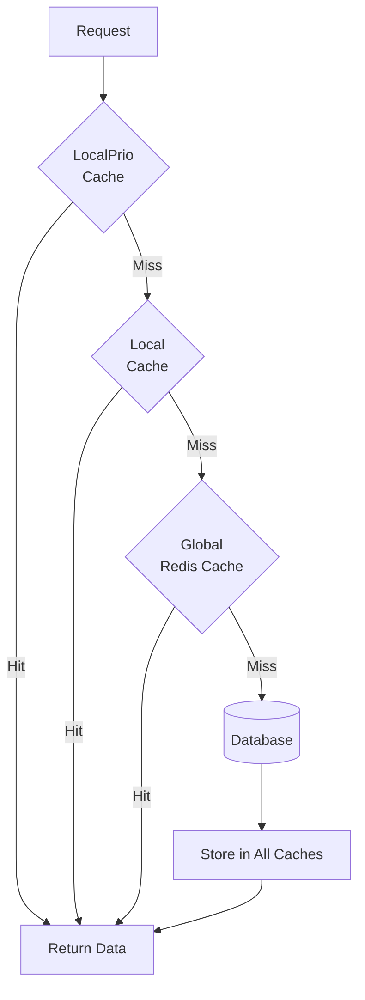

**Three-tier caching strategy:**

| Cache Level | Storage | Speed | Scope | Use Case |
|-------------|---------|-------|-------|----------|
| **LocalPrio** | In-Memory | Fastest | Single Server | Hot data, frequently accessed |
| **Local** | In-Memory | Fast | Single Server | General caching |
| **Global** | Redis | Network | Cluster-wide | Distributed data, rate limits |

**Usage example:**

```dart
// Try all cache levels in order
var data = await session.caches.localPrio.get<MyModel>(key);
data ??= await session.caches.local.get<MyModel>(key);
data ??= await session.caches.global.get<MyModel>(key);

// Store with TTL
await session.caches.global.put(key, data, lifetime: Duration(hours: 1));
```

---

### Internationalization (i18n)

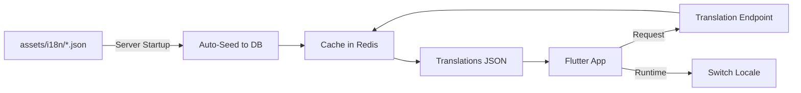

**Auto-seeding translations on server startup:**

```
assets/i18n/
├── en.i18n.json    # English translations
├── tr.i18n.json    # Turkish translations
└── de.i18n.json    # German translations
```

**Translation file format:**

```json
{
  "welcome": {
    "title": "Welcome, {name}!",
    "subtitle": "We're glad to have you here"
  },
  "common": {
    "save": "Save",
    "cancel": "Cancel"
  }
}
```

**Flutter usage:**

```dart
// Load translations on app start
await TranslationService.loadTranslations(client);

// Use translations with interpolation
Text(tr('welcome.title', args: {'name': 'John'}));

// Switch locale at runtime
await TranslationService.changeLocale(client, 'tr');
```

---

### App Configuration

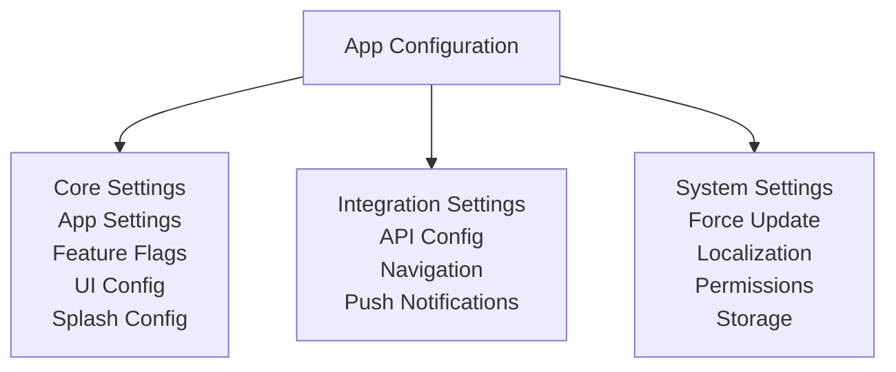

Centralized configuration management including:
- App settings
- Feature flags
- UI configuration
- Splash screen configuration
- Integration settings (API, navigation, push notifications)
- System settings (force update, localization, permissions, storage)

### Integrations

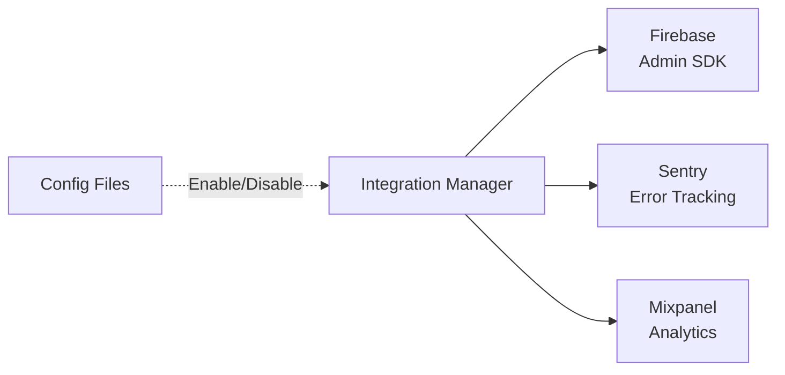

- **Firebase**: Firebase Admin SDK integration
- **Sentry**: Error tracking and monitoring
- **Mixpanel**: Analytics and event tracking

Integrations can be enabled/disabled via configuration files.

### Authentication

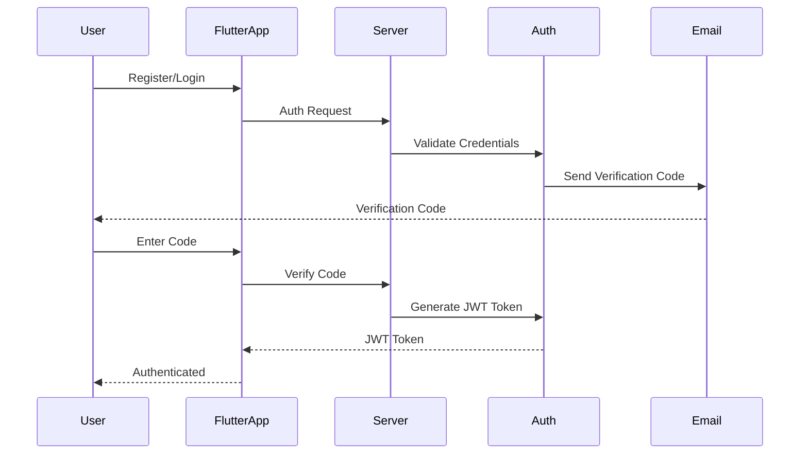

- Email/password authentication
- JWT token-based authentication
- Registration verification codes
- Password reset functionality

### Scheduling

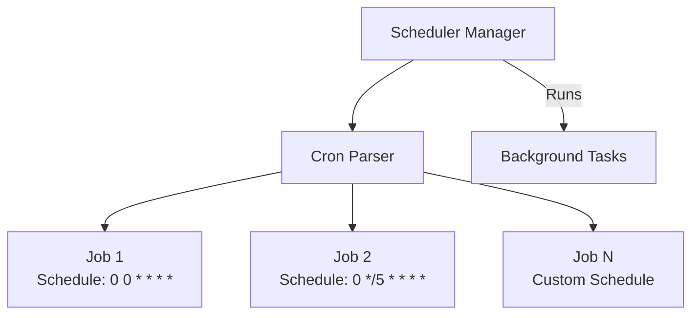

Cron-based job scheduling system for background tasks.

---

### Flutter UI Components

**Rate Limit Banner** - Shows when user is rate limited:

```
┌─────────────────────────────────────────┐
│ ████████░░░░░░░░░░░░░░░░░░░░░░░░░░░░░░ │
├─────────────────────────────────────────┤
│ ⏱️  Rate limit reached                  │
│                                         │
│ ┌─────────┐ ┌─────────┐ ┌─────────┐    │
│ │Wait time│ │Requests │ │ Window  │    │
│ │  45s    │ │ 21/20   │ │  60s    │    │
│ └─────────┘ └─────────┘ └─────────┘    │
│                                         │
│ When ready: [   Try Again   ]           │
└─────────────────────────────────────────┘
```

**Rate Limit Indicator** - Shows remaining requests:

```
Normal:   [🟢 15 left ████████░░]
Warning:  [🟠  3 left ██████████████░░░]  
Danger:   [🔴  1 left ███████████████████░]
```

**Greeting Result Card** - Modern response display:

```
┌─────────────────────────────────────────┐
│ ✓ Server Response              Just now │
├─────────────────────────────────────────┤
│ 💬 Message                              │
│ ┌─────────────────────────────────────┐ │
│ │ Hello John                          │ │
│ └─────────────────────────────────────┘ │
│                                         │
│ ┌─────────────┐  ┌─────────────┐       │
│ │ 👤 Author   │  │ ⏰ Time      │       │
│ │ Serverpod   │  │ 15:45:30    │       │
│ └─────────────┘  └─────────────┘       │
└─────────────────────────────────────────┘
```

**Features:**
- Countdown timer with live seconds remaining
- Color-coded status indicators
- Loading states with disabled inputs
- Auto-retry button when countdown finishes
- Beautiful gradient cards

---

### Health Monitoring

Real-time service health monitoring with auto-refresh.

**Dashboard View:**

```
┌─────────────────────────────────────────────────┐
│  MasterFabric                    ✓ 5/5   ↪  │
├─────────────────────────────────────────────────┤
│  Dashboard                                      │
│  Monitor and test your Serverpod backend...    │
│                                                 │
│  ┌─────────────────────────────────────────┐    │
│  │ Service Health                     🔄   │    │
│  │ ✓ All Systems Operational       125ms   │    │
│  ├─────────────────────────────────────────┤    │
│  │ ✓ API Server           23ms  Connected  │    │
│  │ ✓ Greeting Service     45ms  OK (18/20) │    │
│  │ ✓ Translation Service  32ms  Available  │    │
│  │ ✓ App Config Service   15ms  Loaded     │    │
│  │ ✓ Auth Service         10ms  Available  │    │
│  └─────────────────────────────────────────┘    │
│                                                 │
│  Developer Tools                                │
│  ┌─────────────────────────────────────────┐    │
│  │ 🔬  Service Testing              >      │    │
│  │     Test API, auth flows, rate limits   │    │
│  └─────────────────────────────────────────┘    │
│                                                 │
│  About                                          │
│  ┌─────────────────────────────────────────┐    │
│  │ Auth       Email, Google, Apple         │    │
│  │ Rate Limit 20 requests/minute           │    │
│  │ Caching    Redis + Local cache          │    │
│  │ i18n       EN, TR, DE                   │    │
│  └─────────────────────────────────────────┘    │
└─────────────────────────────────────────────────┘
```

**Service Test Screen:**

| Tab | Description |
|-----|-------------|
| **Health** | Health status card, auto-check toggle |
| **API** | Test Greeting, Translation, Config endpoints |
| **Auth** | Check auth status, profile, sessions, password validation |
| **Rate Limit** | Bulk request testing, stats, request log |

**Health Service Features:**
- Auto health checks (configurable interval, default 60s)
- Service status: healthy, degraded, unhealthy, unknown
- Latency tracking per service
- ChangeNotifier for reactive UI updates

---

### Session Management

JWT token-based session management.

**Available Methods:**

| Method | Description |
|--------|-------------|
| `getCurrentSession()` | Get current JWT session info |
| `getActiveSessions()` | Get all sessions (returns JWT if no server-side) |
| `revokeSession(id)` | Revoke a specific session |
| `revokeAllOtherSessions()` | Revoke all except current |
| `revokeAllSessions()` | Revoke all sessions |

**Flutter Usage:**

```dart
// Get current session info
final session = await client.sessionManagement.getCurrentSession();
print('User ID: ${session.userId}');
print('Method: ${session.method}');  // "jwt"

// Get all sessions
final sessions = await client.sessionManagement.getActiveSessions();
```

---

### Error Handling

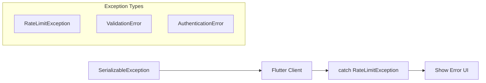

**SerializableExceptions** are properly returned to clients instead of generic "Internal Server Error":

```dart
// Server throws SerializableException
throw RateLimitException(
  message: 'Rate limit exceeded...',
  limit: 20,
  current: 21,
  retryAfterSeconds: 45,
  ...
);

// Flutter catches specific exception
try {
  await client.greeting.hello(name);
} on RateLimitException catch (e) {
  // Show rate limit UI with countdown
  showRateLimitBanner(e);
}
```

## CI/CD

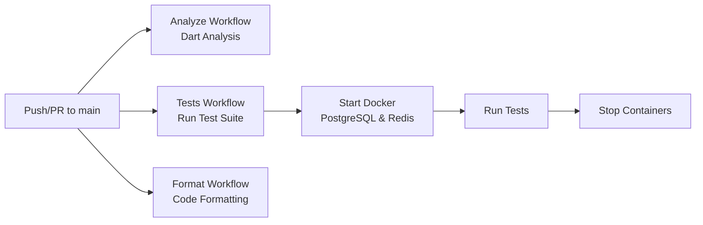

The project includes GitHub Actions workflows:

- **Analyze**: Runs Dart analysis on push/PR to main branch
- **Tests**: Runs test suite with Docker containers
- **Format**: Code formatting checks

## Environment Configuration

Server configuration files are located in `masterfabric_serverpod_server/config/`:
- `development.yaml`: Development environment settings
- `production.yaml`: Production environment settings

## Stopping Services

To stop the server, press `Ctrl-C` in the terminal where it's running.

To stop Docker containers:

```bash
cd masterfabric_serverpod_server
docker compose stop
# Or to remove volumes:
docker compose down -v
```

## Contributing

We welcome contributions! Please read our [Contributing Guidelines](CONTRIBUTING.md) before submitting pull requests or opening issues.

### Quick Start for Contributors

1. Fork the repository
2. Create a feature branch: `git checkout -b feature/your-feature-name`
3. Make your changes and test them
4. Run `dart analyze` and `dart format`
5. Run `serverpod generate` if you modified models/endpoints
6. Commit your changes using [semantic commit messages](.github/COMMIT_GUIDELINES.md)
7. Push to your fork and create a Pull Request

### Commit Messages

We follow [Conventional Commits](https://www.conventionalcommits.org/) for commit messages:

```bash
feat(auth): Add email verification endpoint
fix(session): Resolve session expiration issue
docs(readme): Update setup instructions
```

See [Commit Guidelines](.github/COMMIT_GUIDELINES.md) for quick reference or [CONTRIBUTING.md](CONTRIBUTING.md#commit-guidelines) for detailed guidelines.

### Branch Naming

We use consistent branch naming conventions:

```bash
feature/auth-add-oauth2
bugfix/session-expiration-handling
docs/api-add-endpoint-examples
```

See [Branch Guidelines](.github/BRANCH_GUIDELINES.md) for quick reference or [CONTRIBUTING.md](CONTRIBUTING.md#branch-guidelines) for detailed guidelines.

## Documentation

- [Serverpod Documentation](https://docs.serverpod.dev)
- [Contributing Guidelines](CONTRIBUTING.md)
- [Commit Guidelines](.github/COMMIT_GUIDELINES.md) - Quick reference for semantic commits
- [Branch Guidelines](.github/BRANCH_GUIDELINES.md) - Quick reference for branch naming
- Individual component READMEs:
  - [Server README](masterfabric_serverpod_server/README.md)
  - [Flutter App README](masterfabric_serverpod_flutter/README.md)
  - [Client README](masterfabric_serverpod_client/README.md)

## Author

**Gurkan Fikret Gunak**

- GitHub: [@gurkanfikretgunak](https://github.com/gurkanfikretgunak)

## License

[Add your license here]
