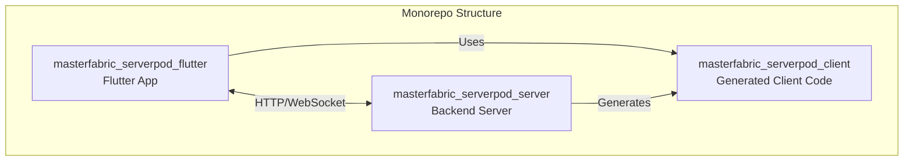
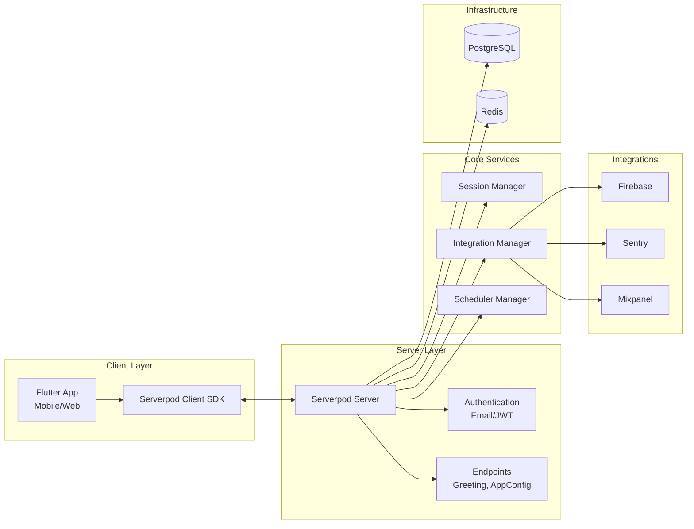
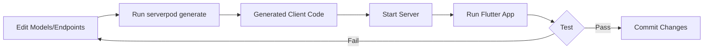
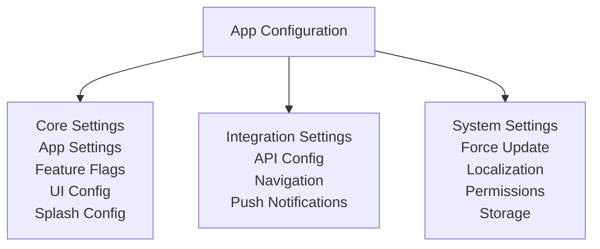
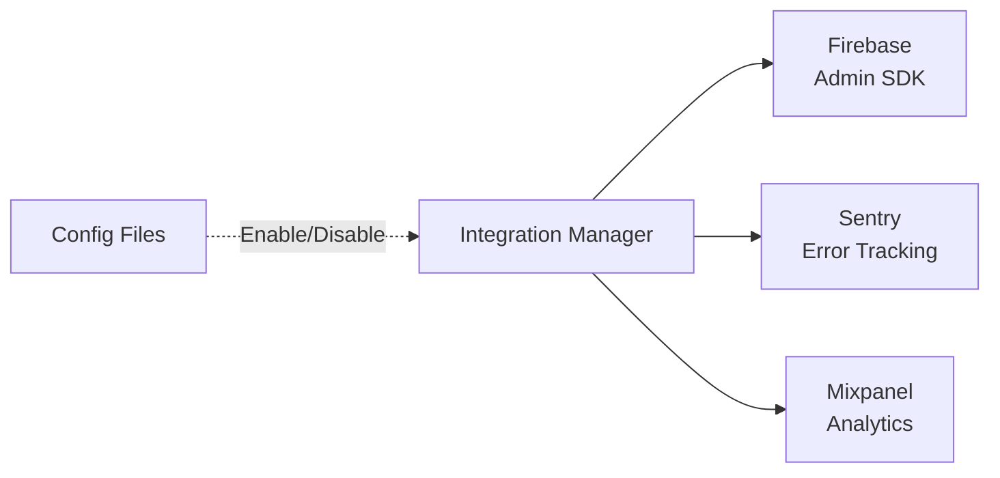
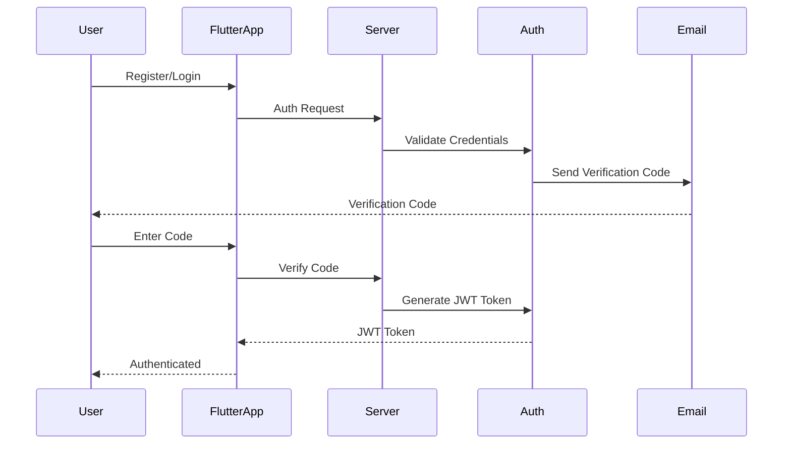
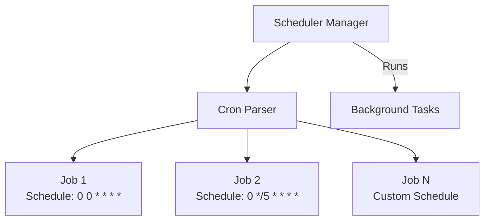
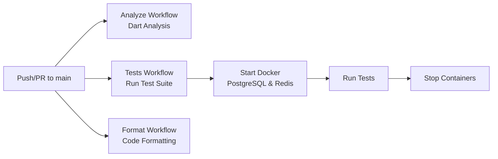

# MasterFabric Serverpod

<div align="center">


[](https://github.com/gurkanfikretgunak/masterfabric_serverpod/stargazers)
[](https://github.com/gurkanfikretgunak/masterfabric_serverpod/network/members)

</div>

A full-stack Flutter application built with Serverpod, featuring app configuration management, authentication, and integrations with Firebase, Sentry, and Mixpanel.

## Overview

This is a monorepo containing three main components:

- **masterfabric_serverpod_client**: Serverpod client package (generated code)
- **masterfabric_serverpod_flutter**: Flutter mobile/web application
- **masterfabric_serverpod_server**: Serverpod backend server with core services

## Architecture

### Project Structure

```
masterfabric_serverpod/
├── masterfabric_serverpod_client/    # Client package (shared between Flutter app and server)
├── masterfabric_serverpod_flutter/   # Flutter application
└── masterfabric_serverpod_server/    # Serverpod backend server
```

### Component Architecture



### System Architecture



## Prerequisites

- **Dart SDK**: `^3.8.0`
- **Flutter SDK**: `^3.32.0`
- **Docker** and **Docker Compose** (for PostgreSQL and Redis)
- **Serverpod CLI**: `3.2.3`

## Getting Started

### Setup Flow


### 1. Install Dependencies

Install dependencies for all packages:

```bash
# Install server dependencies
cd masterfabric_serverpod_server
dart pub get

# Install client dependencies
cd ../masterfabric_serverpod_client
dart pub get

# Install Flutter dependencies
cd ../masterfabric_serverpod_flutter
flutter pub get
```

### 2. Start Infrastructure

Start PostgreSQL and Redis using Docker Compose:

```bash
cd masterfabric_serverpod_server
docker compose up --build --detach
```

### 3. Generate Serverpod Code

Generate the Serverpod client code:

```bash
cd masterfabric_serverpod_server
dart pub global activate serverpod_cli 3.2.3
serverpod generate
```

### 4. Seed App Configuration (Optional)

Seed initial app configuration data:

```bash
cd masterfabric_serverpod_server
serverpod run seed-app-config
```

### 5. Start the Server

Start the Serverpod server:

```bash
cd masterfabric_serverpod_server
dart bin/main.dart
# Or use the start script which applies migrations:
serverpod run start
```

### 6. Run the Flutter App

In a new terminal:

```bash
cd masterfabric_serverpod_flutter
flutter run
```

## Project Structure

### Server (`masterfabric_serverpod_server`)

- **Core Services**:
  - `SessionManager`: Manages user sessions with configurable TTL
  - `IntegrationManager`: Manages integrations (Firebase, Sentry, Mixpanel)
  - `SchedulerManager`: Handles cron-based scheduled tasks
  - `HealthCheckHandler`: Custom health check implementation

- **Features**:
  - App Configuration: Centralized app settings, feature flags, UI configuration
  - Authentication: Email/password authentication with JWT tokens
  - Integrations: Firebase, Sentry, Mixpanel (configurable)
  - Scheduling: Cron-based job scheduling

- **Endpoints**:
  - `GreetingEndpoint`: Example greeting endpoint
  - `AppConfigEndpoint`: App configuration management

### Client (`masterfabric_serverpod_client`)

Generated client code that provides:
- Protocol definitions
- Endpoint clients
- App configuration models

### Flutter App (`masterfabric_serverpod_flutter`)

Flutter application that uses the Serverpod client to communicate with the backend.

## Available Scripts

### Server Scripts

Run scripts using `serverpod run <script-name>`:

- **`start`**: Starts the server and applies migrations
- **`seed-app-config`**: Seeds initial app configuration data
- **`flutter_build`**: Builds the Flutter web app and copies it to the server's web directory

Example:
```bash
cd masterfabric_serverpod_server
serverpod run start
```

## Development Workflow



1. **Make changes** to your models/endpoints in the server
2. **Generate code**: Run `serverpod generate` in the server directory
3. **Test locally**: Start the server and run the Flutter app
4. **Commit changes**: The generated code will be committed to version control

## Key Features

### App Configuration



Centralized configuration management including:
- App settings
- Feature flags
- UI configuration
- Splash screen configuration
- Integration settings (API, navigation, push notifications)
- System settings (force update, localization, permissions, storage)

### Integrations



- **Firebase**: Firebase Admin SDK integration
- **Sentry**: Error tracking and monitoring
- **Mixpanel**: Analytics and event tracking

Integrations can be enabled/disabled via configuration files.

### Authentication



- Email/password authentication
- JWT token-based authentication
- Registration verification codes
- Password reset functionality

### Scheduling



Cron-based job scheduling system for background tasks.

## CI/CD



The project includes GitHub Actions workflows:

- **Analyze**: Runs Dart analysis on push/PR to main branch
- **Tests**: Runs test suite with Docker containers
- **Format**: Code formatting checks

## Environment Configuration

Server configuration files are located in `masterfabric_serverpod_server/config/`:
- `development.yaml`: Development environment settings
- `production.yaml`: Production environment settings

## Stopping Services

To stop the server, press `Ctrl-C` in the terminal where it's running.

To stop Docker containers:

```bash
cd masterfabric_serverpod_server
docker compose stop
# Or to remove volumes:
docker compose down -v
```

## Contributing

We welcome contributions! Please read our [Contributing Guidelines](CONTRIBUTING.md) before submitting pull requests or opening issues.

### Quick Start for Contributors

1. Fork the repository
2. Create a feature branch: `git checkout -b feature/your-feature-name`
3. Make your changes and test them
4. Run `dart analyze` and `dart format`
5. Run `serverpod generate` if you modified models/endpoints
6. Commit your changes using [semantic commit messages](.github/COMMIT_GUIDELINES.md)
7. Push to your fork and create a Pull Request

### Commit Messages

We follow [Conventional Commits](https://www.conventionalcommits.org/) for commit messages:

```bash
feat(auth): Add email verification endpoint
fix(session): Resolve session expiration issue
docs(readme): Update setup instructions
```

See [Commit Guidelines](.github/COMMIT_GUIDELINES.md) for quick reference or [CONTRIBUTING.md](CONTRIBUTING.md#commit-guidelines) for detailed guidelines.

### Branch Naming

We use consistent branch naming conventions:

```bash
feature/auth-add-oauth2
bugfix/session-expiration-handling
docs/api-add-endpoint-examples
```

See [Branch Guidelines](.github/BRANCH_GUIDELINES.md) for quick reference or [CONTRIBUTING.md](CONTRIBUTING.md#branch-guidelines) for detailed guidelines.

## Documentation

- [Serverpod Documentation](https://docs.serverpod.dev)
- [Contributing Guidelines](CONTRIBUTING.md)
- [Commit Guidelines](.github/COMMIT_GUIDELINES.md) - Quick reference for semantic commits
- [Branch Guidelines](.github/BRANCH_GUIDELINES.md) - Quick reference for branch naming
- Individual component READMEs:
  - [Server README](masterfabric_serverpod_server/README.md)
  - [Flutter App README](masterfabric_serverpod_flutter/README.md)
  - [Client README](masterfabric_serverpod_client/README.md)

## Author

**Gurkan Fikret Gunak**

- GitHub: [@gurkanfikretgunak](https://github.com/gurkanfikretgunak)

## License

[Add your license here]
