# MasterFabric Serverpod

<div align="center">


<br/>


[](https://github.com/gurkanfikretgunak/masterfabric_serverpod/stargazers)
[](https://github.com/gurkanfikretgunak/masterfabric_serverpod/network/members)

</div>

A production-ready full-stack Flutter application built with Serverpod, featuring rate limiting, multi-level caching, internationalization, app configuration management, authentication, and integrations with Firebase, Sentry, and Mixpanel.

## Highlights

| Feature | Description |
|---------|-------------|
| **Rate Limiting** | Distributed rate limiting with Redis, configurable per endpoint |
| **Multi-Level Caching** | Local, LocalPrio, and Global (Redis) caching strategies |
| **Internationalization** | Auto-seeding translations (EN, TR, DE, ES) with runtime locale switching |
| **Real-Time Notifications** | WebSocket streaming for broadcasts, user-based, and project-based notifications |
| **Modern Error Handling** | SerializableExceptions with detailed error responses |
| **Health Monitoring** | Real-time service health checks with auto-refresh |
| **Settings & i18n** | Settings screen with language selection, responsive layouts |
| **Service Testing** | Built-in test UI for API, Auth, and Rate Limit testing |
| **Beautiful Flutter UI** | Rate limit banners, health indicators, notification center |
| **Authentication** | Email/password auth with JWT tokens and session management |
| **Multi-Channel Verification** | Email, Telegram Bot API, WhatsApp Business API for OTP delivery |
| **Middleware System** | Automatic logging, rate limiting, auth, validation, metrics per endpoint |
| **RBAC** | Role-Based Access Control with automatic role assignment on signup |
| **Integrations** | Firebase, Sentry, Mixpanel, Telegram, WhatsApp (configurable) |

## Screenshots

<table>
  <tr>
    <td></td>
    <td></td>
    <td></td>
    <td></td>
  </tr>
  <tr>
    <td align="center"><b>Dashboard</b></td>
    <td align="center"><b>Test View</b></td>
    <td align="center"><b>Service Testing</b></td>
    <td align="center"><b>Auth Check</b></td>
  </tr>
</table>

## Quick Start

### One Command Development

```bash
# Full stack with Flutter web (default)
./dev.sh

# Full stack with specific platform
./dev.sh --ios        # iOS Simulator
./dev.sh --android    # Android Emulator
./dev.sh --macos      # macOS Desktop
./dev.sh --web        # Chrome/Web (default)

# Server only (no Flutter)
./dev.sh --no-flutter
./dev-server.sh
```

This will:
1. **Check prerequisites** (Docker, Dart, Flutter, Serverpod CLI)
2. **Start Docker** services (PostgreSQL + Redis)
3. **Generate** Serverpod code
4. **Run** the server with clean logs
5. **Launch** Flutter app (dev.sh only)

### Manual Setup

```bash
# 1. Start Docker services
cd masterfabric_serverpod_server
docker compose up -d

# 2. Install dependencies
dart pub get

# 3. Generate code
serverpod generate

# 4. Run server
dart run bin/main.dart

# 5. Run Flutter (in another terminal)
cd ../masterfabric_serverpod_flutter
flutter run
```

## Development Scripts

| Script | Location | Description |
|--------|----------|-------------|
| `dev.sh` | Root | Full stack development (Docker + Server + Flutter) |
| `dev-server.sh` | Root | Server only development (Docker + Server) |
| `run_clean.sh` | `server/bin/` | Run server with filtered logs (no stack traces) |

### `./dev.sh` - Full Stack Development

The main development script that sets up everything automatically.

**Platform Flags:**

| Flag | Short | Description |
|------|-------|-------------|
| `--web` | `-w` | Run Flutter on Chrome/Web (default) |
| `--ios` | `-i` | Run Flutter on iOS Simulator |
| `--android` | `-a` | Run Flutter on Android Emulator |
| `--macos` | `-m` | Run Flutter on macOS Desktop |
| `--no-flutter` | `-n` | Run server only (no Flutter) |
| `--help` | `-h` | Show help message |

**Examples:**

```bash
./dev.sh              # Default: web
./dev.sh --ios        # iOS Simulator
./dev.sh -a           # Android Emulator  
./dev.sh --no-flutter # Server only
```

**Output:**

```
╔═══════════════════════════════════════════════════════════════════════╗
║   MasterFabric Serverpod                                              ║
║   Local Development Environment                                        ║
╚═══════════════════════════════════════════════════════════════════════╝

[0] Checking prerequisites...
  ✓ Docker is installed
  ✓ Dart: Dart SDK version: 3.8.0
  ✓ Flutter: Flutter 3.32.0
  ✓ Serverpod CLI is installed

[1] 🐳 Starting Docker services...
  ✓ PostgreSQL is ready on port 8090
  ✓ Redis is ready on port 8091

[2] 🔧 Installing dependencies & generating code...
  ✓ Serverpod code generated

[3] 🖥 Starting Serverpod server...
  ✓ Server running at http://localhost:8080

[4] 📱 Starting Flutter app...
```

**Features:**
- Automatic prerequisite checking
- Docker container management (starts if needed, skips if running)
- Waits for services to be ready before proceeding
- Clean colored terminal output
- Graceful shutdown with `Ctrl+C`

### `./dev-server.sh` - Server Only Development

Lightweight script for backend-only development:

```bash
./dev-server.sh
```

**Use when:**
- Working on backend/API changes
- Testing endpoints with Postman/Insomnia
- Running integration tests
- Don't need the Flutter app

### Clean Logs

The scripts filter out noisy Dart async stack traces for cleaner output:

**Before (default Serverpod logs):**
```
ERROR          RateLimitException(message: Rate limit exceeded...)
STACK TRACE    #0      RateLimitService.checkLimit (package:...)
<asynchronous suspension>
#1      GreetingEndpoint.hello (package:...)
<asynchronous suspension>
```

**After (with dev scripts):**
```
⚡ RATE LIMITED │ greeting/hello │ 21/20 requests │ retry in 38s
ERROR          RateLimitException(message: Rate limit exceeded...)
```

### Services & Ports

| Service | Port | Description |
|---------|------|-------------|
| PostgreSQL | 8090 | Database |
| Redis | 8091 | Cache & Rate Limiting |
| API Server | 8080 | Main API endpoint |
| Insights | 8081 | Serverpod Insights dashboard |
| Web Server | 8082 | Static files & Flutter web |

### Stopping Services

```bash
# Stop dev script (Ctrl+C stops server & Flutter)
# Docker containers keep running for quick restart

# To fully stop Docker:
cd masterfabric_serverpod_server
docker compose down

# To stop and remove volumes (fresh start):
docker compose down -v
```

## Cursor IDE Support

This project includes Cursor IDE commands and skills for enhanced AI-assisted development.

### Commands

Located in `.cursor/commands/`:

| Command | Description |
|---------|-------------|
| `/create-server-service` | Scaffold new Serverpod service with endpoint, service class, and models |
| `/create-server-endpoint` | Create V2 (middleware) or V3 (RBAC) endpoints with templates |
| `/create-server-integration` | Create REST API integration with base client and patterns |
| `/check-performance-service` | Test and monitor service performance |

### Skills

Located in `.cursor/skills/masterfabric-server/`:

| File | Purpose |
|------|---------|
| `SKILL.md` | Project standards, patterns, and service creation guide |
| `SERVICES.md` | Reference for existing services and configurations |

### Usage

The AI agent automatically uses these skills when:
- Creating new API endpoints or services
- Adding external integrations (Stripe, Twilio, etc.)
- Working with rate limiting, caching, or authentication
- Checking service performance

```
.cursor/
├── commands/
│   ├── create-server-service.md
│   ├── create-server-endpoint.md
│   ├── create-server-integration.md
│   └── check-performance-service.md
└── skills/
    └── masterfabric-server/
        ├── SKILL.md
        └── SERVICES.md
```

## Overview

This is a monorepo containing three main components:

- **masterfabric_serverpod_client**: Serverpod client package (generated code)
- **masterfabric_serverpod_flutter**: Flutter mobile/web application
- **masterfabric_serverpod_server**: Serverpod backend server with core services

## Architecture

### Project Structure

```
masterfabric_serverpod/
├── masterfabric_serverpod_client/    # Client package (shared between Flutter app and server)
├── masterfabric_serverpod_flutter/   # Flutter application
└── masterfabric_serverpod_server/    # Serverpod backend server
```

### Component Architecture


### System Architecture


## Prerequisites

- **Dart SDK**: `^3.8.0`
- **Flutter SDK**: `^3.32.0`
- **Docker** and **Docker Compose** (for PostgreSQL and Redis)
- **Serverpod CLI**: `3.2.3`

## Getting Started

### Setup Flow


### 1. Install Dependencies

Install dependencies for all packages:

```bash
# Install server dependencies
cd masterfabric_serverpod_server
dart pub get

# Install client dependencies
cd ../masterfabric_serverpod_client
dart pub get

# Install Flutter dependencies
cd ../masterfabric_serverpod_flutter
flutter pub get
```

### 2. Start Infrastructure

Start PostgreSQL and Redis using Docker Compose:

```bash
cd masterfabric_serverpod_server
docker compose up --build --detach
```

### 3. Generate Serverpod Code

Generate the Serverpod client code:

```bash
cd masterfabric_serverpod_server
dart pub global activate serverpod_cli 3.2.3
serverpod generate
```

### 4. Seed App Configuration (Optional)

Seed initial app configuration data:

```bash
cd masterfabric_serverpod_server
serverpod run seed-app-config
```

### 5. Start the Server

Start the Serverpod server:

```bash
cd masterfabric_serverpod_server
dart bin/main.dart
# Or use the start script which applies migrations:
serverpod run start
```

### 6. Run the Flutter App

In a new terminal:

```bash
cd masterfabric_serverpod_flutter
flutter run
```

## Project Structure

### Server (`masterfabric_serverpod_server`)

```
lib/src/
├── core/
│   ├── errors/              # Custom error types (ValidationError, etc.)
│   ├── exceptions/          # SerializableExceptions (RateLimitException)
│   │   └── models/          # Exception model definitions (.spy.yaml)
│   ├── health/              # Health check handlers and metrics
│   ├── integrations/        # Firebase, Sentry, Mixpanel
│   ├── logging/             # Structured logging
│   ├── rate_limit/          # Rate limiting service
│   │   ├── models/          # Rate limit entry models
│   │   └── services/        # Rate limit service implementation
│   ├── real_time/           # Real-time features
│   │   └── notifications_center/
│   │       ├── endpoints/   # Notification & stream endpoints
│   │       ├── models/      # Notification models (.spy.yaml)
│   │       ├── services/    # Notification, channel, cache services
│   │       └── integrations/# Push notification integrations
│   ├── scheduling/          # Cron-based job scheduling
│   ├── session/             # Session management
│   └── utils/               # Common utilities
├── services/
│   ├── app_config/          # App configuration service
│   │   ├── endpoints/       # Config endpoints
│   │   └── services/        # Config service implementation
│   ├── auth/                # Authentication services
│   │   ├── config/          # Auth configuration
│   │   ├── core/            # Auth audit and helpers
│   │   ├── email/           # Email authentication
│   │   ├── jwt/             # JWT refresh
│   │   ├── oauth/           # Google, Apple OAuth
│   │   ├── password/        # Password management
│   │   ├── rbac/            # Role-based access control
│   │   ├── session/         # Session management
│   │   ├── two_factor/      # 2FA authentication
│   │   ├── user/            # User management
│   │   └── verification/    # Multi-channel verification (Email, Telegram, WhatsApp)
│   ├── greetings/           # Example greeting endpoint
│   │   ├── endpoints/       # Greeting endpoint
│   │   └── models/          # Greeting models
│   ├── health/              # Health check endpoints
│   │   ├── endpoints/       # Health endpoint
│   │   └── models/          # Health response models
│   └── translations/        # i18n translation service
│       ├── endpoints/       # Translation endpoint
│       ├── models/          # Translation models
│       └── services/        # Translation service implementation
└── generated/               # Serverpod generated code
```

**Module Organization Pattern:**

Each module follows a consistent structure with barrel exports:

```
module_name/
├── module_name.dart         # Barrel export file
├── endpoints/               # API endpoints
├── models/                  # Data models (.spy.yaml)
├── services/                # Business logic
└── integrations/            # External integrations (optional)
```

- **Core Services**:
  - `RateLimitService`: Distributed rate limiting with Redis
  - `TranslationService`: i18n with auto-seeding from JSON files
  - `SessionManager`: Manages user sessions with configurable TTL
  - `IntegrationManager`: Manages integrations (Firebase, Sentry, Mixpanel, Telegram, WhatsApp)
  - `SchedulerManager`: Handles cron-based scheduled tasks
  - `VerificationChannelRouter`: Routes verification codes to preferred channel

- **Features**:
  - **Rate Limiting**: Per-endpoint configurable limits with Redis
  - **Caching**: LocalPrio → Local → Global (Redis) strategy
  - **Translations**: Auto-seed from `assets/i18n/*.json`
  - **App Configuration**: Centralized settings, feature flags
  - **Authentication**: Email/password with JWT tokens, 2FA
  - **Multi-Channel Verification**: Email, Telegram Bot API, WhatsApp Business API
  - **Integrations**: Firebase, Sentry, Mixpanel, Telegram, WhatsApp (configurable)

- **Endpoints**:
  - `GreetingEndpoint`: Example with rate limiting & caching
  - `AppConfigEndpoint`: App configuration management
  - `TranslationEndpoint`: Translation retrieval & management

### Client (`masterfabric_serverpod_client`)

Generated client code that provides:
- Protocol definitions
- Endpoint clients
- App configuration models
- **SerializableExceptions** (RateLimitException, etc.)

### Flutter App (`masterfabric_serverpod_flutter`)

```
lib/
├── main.dart                     # App entry point with bootstrap
├── screens/
│   ├── home_screen.dart              # Dashboard with health status
│   ├── settings_screen.dart          # Settings with language, about, preferences
│   ├── service_test_screen.dart      # Service testing (API, Auth, Rate Limit)
│   ├── greeting_v2_screen.dart       # Middleware test (V2)
│   ├── greeting_v3_screen.dart       # RBAC test (V3)
│   ├── greetings_screen.dart         # Greeting screen with rate limit UI
│   ├── sign_in_screen.dart           # Email authentication screen
│   ├── profile_screen.dart           # User profile screen
│   ├── verification_settings_screen.dart  # Multi-channel verification preferences
│   └── notifications/                # Real-time notifications
│       ├── notifications.dart            # Barrel export
│       ├── notification_center_screen.dart   # Notification center UI
│       └── notification_item_widget.dart     # Notification list item
├── services/
│   ├── app_config_service.dart       # App config client
│   ├── health_service.dart           # Health monitoring service
│   ├── notification_service.dart     # Real-time notification service
│   └── translation_service.dart      # i18n client with locale switching
├── utils/
│   └── responsive.dart               # Responsive layout utilities
└── widgets/
    ├── health_status_bar.dart        # Health indicator & status card
    ├── notification_badge.dart       # Notification count badge
    └── rate_limit_banner.dart        # Rate limit UI components
```

**Features**:
- **Email Sign-in** with verification
- **Settings Screen** with language selection, notifications, privacy, about info
- **Health Monitoring** with auto-check (configurable interval)
- **Real-Time Notifications** with WebSocket streaming
- **Service Testing** screen (API, Auth, Rate Limit tabs)
- **RBAC Testing** screen (V3) with role-based method testing
- **Middleware Testing** screen (V2) with rate limit and auth testing
- **Verification Settings** for Email, Telegram, WhatsApp preferences
- **Responsive Layouts** adapting to mobile, tablet, and desktop
- **Internationalization** with runtime locale switching (EN, TR, DE, ES)
- Notification center with filtering and real-time updates
- Rate limit banner with countdown timer
- Rate limit indicator showing remaining requests
- Modern greeting result cards
- Loading states & error handling

## Available Scripts

### Server Scripts

Run scripts using `serverpod run <script-name>`:

- **`start`**: Starts the server and applies migrations
- **`seed-app-config`**: Seeds initial app configuration data
- **`flutter_build`**: Builds the Flutter web app and copies it to the server's web directory

Example:
```bash
cd masterfabric_serverpod_server
serverpod run start
```

## Development Workflow


1. **Make changes** to your models/endpoints in the server
2. **Generate code**: Run `serverpod generate` in the server directory
3. **Test locally**: Start the server and run the Flutter app
4. **Commit changes**: The generated code will be committed to version control

## Key Features

### Rate Limiting


**Server-side rate limiting with Redis:**

```dart
// Configure rate limit per endpoint
static const _rateLimitConfig = RateLimitConfig(
  maxRequests: 20,           // Max requests allowed
  windowDuration: Duration(minutes: 1),  // Time window
  keyPrefix: 'greeting',     // Cache key prefix
);

// Check rate limit (throws RateLimitException if exceeded)
await RateLimitService.checkLimit(session, _rateLimitConfig, identifier);
```

**Response includes rate limit info:**

```json
{
  "message": "Hello John",
  "rateLimitMax": 20,
  "rateLimitRemaining": 15,
  "rateLimitCurrent": 5,
  "rateLimitWindowSeconds": 60,
  "rateLimitResetInSeconds": 45
}
```

**When limit is exceeded (SerializableException):**

```json
{
  "__className__": "RateLimitException",
  "message": "Rate limit exceeded. You have made 21 requests...",
  "limit": 20,
  "remaining": 0,
  "current": 21,
  "retryAfterSeconds": 45,
  "resetAt": "2026-01-31T15:46:33.000Z"
}
```

---

### Multi-Level Caching


**Three-tier caching strategy:**

| Cache Level | Storage | Speed | Scope | Use Case |
|-------------|---------|-------|-------|----------|
| **LocalPrio** | In-Memory | Fastest | Single Server | Hot data, frequently accessed |
| **Local** | In-Memory | Fast | Single Server | General caching |
| **Global** | Redis | Network | Cluster-wide | Distributed data, rate limits |

**Usage example:**

```dart
// Try all cache levels in order
var data = await session.caches.localPrio.get<MyModel>(key);
data ??= await session.caches.local.get<MyModel>(key);
data ??= await session.caches.global.get<MyModel>(key);

// Store with TTL
await session.caches.global.put(key, data, lifetime: Duration(hours: 1));
```

---

### Internationalization (i18n)


**Auto-seeding translations on server startup:**

```
assets/i18n/
├── en.i18n.json    # English translations
├── tr.i18n.json    # Turkish translations
├── de.i18n.json    # German translations
└── es.i18n.json    # Spanish translations
```

**Translation file format:**

```json
{
  "app": { "name": "MasterFabric", "version": "1.0.0" },
  "welcome": {
    "title": "Welcome",
    "subtitle": "Sign in to continue"
  },
  "settings": {
    "title": "Settings",
    "language": {
      "title": "Language",
      "subtitle": "Choose your preferred language",
      "changeSuccess": "Language changed to $language"
    }
  },
  "common": { "save": "Save", "cancel": "Cancel" },
  "languages": { "en": "English", "tr": "Turkish", "de": "German", "es": "Spanish" }
}
```

**Flutter usage:**

```dart
// Load translations on app start
await TranslationService.loadTranslations(client);

// Use translations with interpolation
Text(tr('welcome.title', args: {'name': 'John'}));

// Switch locale at runtime
await TranslationService.changeLocale(client, 'tr');
```

---

### App Configuration


Centralized configuration management including:
- App settings
- Feature flags
- UI configuration
- Splash screen configuration
- Integration settings (API, navigation, push notifications)
- System settings (force update, localization, permissions, storage)

### Integrations


| Integration | Purpose | API |
|-------------|---------|-----|
| **Firebase** | Admin SDK, Push Notifications | Firebase Admin |
| **Sentry** | Error tracking and monitoring | Sentry SDK |
| **Mixpanel** | Analytics and event tracking | Mixpanel API |
| **Telegram** | Verification codes via bot | Telegram Bot API |
| **WhatsApp** | Verification codes via templates | WhatsApp Business Cloud API |

Integrations can be enabled/disabled via configuration files (`config/development.yaml`, `config/production.yaml`).

### Real-Time Notifications


**Server-side notification management:**

```dart
// Create a notification channel
final channel = await client.notification.createChannel(
  name: 'announcements',
  type: ChannelType.broadcast,
  isPublic: true,
);

// Send notification to channel
await client.notification.send(
  channelId: channel.id,
  title: 'New Feature!',
  message: 'Check out the new dashboard',
  priority: NotificationPriority.high,
);
```

**Flutter real-time subscription:**

```dart
// Subscribe to broadcasts
await notificationService.subscribeToBroadcasts(channelIds);

// Listen for new notifications
notificationService.addListener(() {
  final notifications = notificationService.notifications;
  // Update UI
});
```

**Features:**
- WebSocket streaming for real-time updates
- Public broadcasts with Redis caching (supports 50k+ concurrent users)
- User-specific notifications
- Project-based notifications
- Priority levels (low, medium, high, urgent)
- Read/unread status tracking
- Notification filtering and search

---

### Authentication


- Email/password authentication
- JWT token-based authentication
- Registration verification codes
- Password reset functionality

### Role-Based Access Control (RBAC)

```mermaid
graph TB
    subgraph "Default Roles"
        Public[🌍 public<br/>Unauthenticated access]
        User[👤 user<br/>Default for all signups]
        Moderator[🛡️ moderator<br/>Content moderation]
        Admin[⚡ admin<br/>Full system access]
    end
    
    subgraph "RBAC Flow"
        Request[API Request] --> AuthMiddleware[Auth Middleware]
        AuthMiddleware --> CheckAuth{Authenticated?}
        CheckAuth -->|No| Public
        CheckAuth -->|Yes| CheckRole{Has Required<br/>Role?}
        CheckRole -->|Yes| Allow[✅ Allow Access]
        CheckRole -->|No| Deny[❌ 403 Forbidden]
    end
    
    subgraph "Role Assignment"
        Signup[User Signup] --> AutoAssign[Auto-assign 'user' role]
        AdminAction[Admin Action] --> ManualAssign[Assign/Revoke roles]
    end
```



**Automatic role assignment on user registration:**

When a new user signs up, they automatically receive the `user` role, enabling immediate access to protected endpoints.

**Default Roles:**

| Role | Description | Auto-Assigned |
|------|-------------|---------------|
| `public` | Unauthenticated/public access | No |
| `user` | Default for all authenticated users | Yes (on signup) |
| `moderator` | Content moderation privileges | No |
| `admin` | Full system access | No |

**Server-side RBAC configuration:**

```dart
class GreetingV3Endpoint extends MasterfabricEndpoint with RbacEndpointMixin {
  // Base role requirement for all methods
  @override
  List<String> get requiredRoles => ['user'];

  // Method-specific role requirements
  @override
  Map<String, List<String>> get methodRoles => {
    'adminHello': ['user', 'admin'],        // Either role works (OR)
    'moderatorHello': ['moderator', 'admin'], // Either role works (OR)
    'deleteGreeting': ['user', 'admin'],    // Both required (AND)
  };

  // Require ALL roles vs ANY role
  @override
  Map<String, bool> get methodRequireAllRoles => {
    'adminHello': false,      // OR logic (user OR admin)
    'moderatorHello': false,  // OR logic (moderator OR admin)
    'deleteGreeting': true,   // AND logic (user AND admin)
  };

  // Public endpoint (no auth required)
  Future<Response> publicHello(Session session, String name) async {
    return executeWithMiddleware(
      session: session,
      methodName: 'publicHello',
      config: const EndpointMiddlewareConfig(skipAuth: true),
      handler: () async { /* ... */ },
    );
  }

  // Protected endpoint (requires 'user' role)
  Future<Response> hello(Session session, String name) async {
    return executeWithRbac(
      session: session,
      methodName: 'hello',
      handler: () async { /* ... */ },
    );
  }
}
```

**Role Requirements Examples:**

| Method | Required Roles | Logic | Description |
|--------|---------------|-------|-------------|
| `publicHello` | None | - | No authentication required |
| `hello` | `user` | - | Basic user access |
| `adminHello` | `user`, `admin` | OR | Either role grants access |
| `moderatorHello` | `moderator`, `admin` | OR | Either role grants access |
| `deleteGreeting` | `user`, `admin` | AND | Must have BOTH roles |

**Flutter usage:**

```dart
try {
  // Public - always works
  await client.greetingV3.publicHello('World');
  
  // User role required (auto-assigned on signup)
  await client.greetingV3.hello('World');
  
  // Admin role required
  await client.greetingV3.adminHello('Admin');
} on MiddlewareError catch (e) {
  if (e.code == 'ROLE_DENIED') {
    print('Missing required role: ${e.message}');
  }
}
```

**RBAC Service API:**

```dart
final rbacService = RbacService();

// Check if user has a role
final isAdmin = await rbacService.hasRole(session, userId, 'admin');

// Assign a role to user
await rbacService.assignRole(session, userId, 'moderator');

// Revoke a role from user
await rbacService.revokeRole(session, userId, 'moderator');

// Get all user roles
final roles = await rbacService.getUserRoles(session, userId);

// Get all user permissions (from roles)
final permissions = await rbacService.getUserPermissions(session, userId);
```

**Server startup auto-seeding:**

Default roles are automatically seeded on server startup:

```
[INFO] RBAC roles seeded - 4 role(s) created
[INFO] Created role: public
[INFO] Created role: user
[INFO] Created role: moderator
[INFO] Created role: admin
```

**RBAC Test Screen (Flutter):**

```
┌─────────────────────────────────────────────────┐
│  Greeting V3 (RBAC)                        ↻    │
├─────────────────────────────────────────────────┤
│  Enter Name                                     │
│  ┌─────────────────────────────────────────┐    │
│  │ 👤  World                               │    │
│  └─────────────────────────────────────────┘    │
├─────────────────────────────────────────────────┤
│  Select Endpoint Method                         │
│  ┌─────────────────────────────────────────┐    │
│  │ 🌍 Public Hello          [Public]       │    │
│  │     No auth required                    │    │
│  ├─────────────────────────────────────────┤    │
│  │ 👤 Hello (User)          [user]         │    │
│  │     Requires user role                  │    │
│  ├─────────────────────────────────────────┤    │
│  │ 🛡️ Admin Hello        [user | admin]  ✓ │    │
│  │     Requires user OR admin role         │    │
│  ├─────────────────────────────────────────┤    │
│  │ 👥 Moderator Hello [moderator | admin]  │    │
│  │     Requires moderator OR admin role    │    │
│  ├─────────────────────────────────────────┤    │
│  │ 🗑️ Delete Greeting    [user & admin]    │    │
│  │     Requires user AND admin (both!)     │    │
│  └─────────────────────────────────────────┘    │
├─────────────────────────────────────────────────┤
│  [           Send Request           ]           │
└─────────────────────────────────────────────────┘
```

---

### Multi-Channel Verification

```mermaid
graph TB
    subgraph "Verification Channels"
        Email[📧 Email<br/>Default]
        Telegram[📱 Telegram<br/>Bot API]
        WhatsApp[💬 WhatsApp<br/>Business Cloud API]
        SMS[📲 SMS<br/>Future]
    end
    
    subgraph "Server"
        ChannelRouter[Channel Router<br/>Route to preferred channel]
        VerificationService[Verification Service<br/>Generate & validate codes]
        IntegrationManager[Integration Manager<br/>Manage API clients]
    end
    
    subgraph "User Preferences"
        PreferredChannel[Preferred Channel]
        BackupChannel[Backup Channel]
        PhoneNumber[Phone Number]
        TelegramChatId[Telegram Chat ID]
    end
    
    User[User Request] --> ChannelRouter
    ChannelRouter --> PreferredChannel
    PreferredChannel --> Email
    PreferredChannel --> Telegram
    PreferredChannel --> WhatsApp
    ChannelRouter --> VerificationService
    VerificationService --> IntegrationManager
```



**Multi-channel verification code delivery:**

| Channel | API | Features |
|---------|-----|----------|
| **Email** | SMTP | Default channel, always available |
| **Telegram** | Bot API | Link account via bot, instant delivery |
| **WhatsApp** | Business Cloud API | Pre-approved OTP templates, verified phone |

**Server Configuration (config/development.yaml):**

```yaml
integrations:
  telegram:
    enabled: true
    botToken: ""  # From @BotFather (store in passwords.yaml)
    botUsername: "MyVerificationBot"
    
  whatsapp:
    enabled: true
    phoneNumberId: ""  # From Meta Business Suite
    accessToken: ""    # Store in passwords.yaml
    businessAccountId: ""
    otpTemplateName: "verification_code"
    otpTemplateLanguage: "en"
```

**Flutter usage:**

```dart
// Get available channels
final channels = await client.verificationPreferences.getAvailableChannels();

// Update preferred channel
await client.verificationPreferences.updatePreferences(
  preferredChannel: VerificationChannel.telegram,
  backupChannel: VerificationChannel.email,
);

// Link Telegram account
await client.verificationPreferences.generateTelegramLinkCode();
// User sends code to bot via Telegram

// Verify WhatsApp phone number
await client.verificationPreferences.sendPhoneVerificationCode('+14155551234');
await client.verificationPreferences.verifyPhoneNumber('+14155551234', code);
```

**Verification Settings Screen:**

```
┌─────────────────────────────────────────────────┐
│  Verification Settings                     ↻    │
├─────────────────────────────────────────────────┤
│  ℹ️ Choose how you want to receive              │
│     verification codes for secure actions.      │
├─────────────────────────────────────────────────┤
│  🛡️ Preferred Channel                           │
│  ┌─────────────────────────────────────────┐    │
│  │ ✓ 📧 Email                              │    │
│  │     Receive codes via email             │    │
│  │   📱 Telegram              (Link below) │    │
│  │   💬 WhatsApp              (Verify below)│    │
│  └─────────────────────────────────────────┘    │
├─────────────────────────────────────────────────┤
│  📱 Telegram                        ✓ Linked    │
│  [    Unlink Telegram Account    ]              │
├─────────────────────────────────────────────────┤
│  💬 WhatsApp                       ✓ Verified   │
│  Phone: +1 415 555 1234                         │
│  [    Verify New Number    ]                    │
├─────────────────────────────────────────────────┤
│  🛟 Backup Channel                              │
│  [  Email  ▾ ]                                  │
├─────────────────────────────────────────────────┤
│  [       Save Preferences       ]               │
└─────────────────────────────────────────────────┘
```

### Scheduling


Cron-based job scheduling system for background tasks.

---

### Flutter UI Components

**Rate Limit Banner** - Shows when user is rate limited:

```
┌─────────────────────────────────────────┐
│ ████████░░░░░░░░░░░░░░░░░░░░░░░░░░░░░░ │
├─────────────────────────────────────────┤
│ ⏱️  Rate limit reached                  │
│                                         │
│ ┌─────────┐ ┌─────────┐ ┌─────────┐    │
│ │Wait time│ │Requests │ │ Window  │    │
│ │  45s    │ │ 21/20   │ │  60s    │    │
│ └─────────┘ └─────────┘ └─────────┘    │
│                                         │
│ When ready: [   Try Again   ]           │
└─────────────────────────────────────────┘
```

**Rate Limit Indicator** - Shows remaining requests:

```
Normal:   [🟢 15 left ████████░░]
Warning:  [🟠  3 left ██████████████░░░]  
Danger:   [🔴  1 left ███████████████████░]
```

**Greeting Result Card** - Modern response display:

```
┌─────────────────────────────────────────┐
│ ✓ Server Response              Just now │
├─────────────────────────────────────────┤
│ 💬 Message                              │
│ ┌─────────────────────────────────────┐ │
│ │ Hello John                          │ │
│ └─────────────────────────────────────┘ │
│                                         │
│ ┌─────────────┐  ┌─────────────┐       │
│ │ 👤 Author   │  │ ⏰ Time      │       │
│ │ Serverpod   │  │ 15:45:30    │       │
│ └─────────────┘  └─────────────┘       │
└─────────────────────────────────────────┘
```

**Features:**
- Countdown timer with live seconds remaining
- Color-coded status indicators
- Loading states with disabled inputs
- Auto-retry button when countdown finishes
- Beautiful gradient cards

---

### Settings Screen

Comprehensive settings with language selection and app info.

**Settings Screen Layout:**

```
┌────────────────────────────────────────────────────┐
│  ⚙️ Settings                                        │
├────────────────────────────────────────────────────┤
│  LANGUAGE                                          │
│  ┌──────────────────────────────────────────────┐  │
│  │ 🌐 Choose your preferred language            │  │
│  │    Current: English                          │  │
│  ├──────────────────────────────────────────────┤  │
│  │ 🇺🇸 English                             ✓    │  │
│  │ 🇹🇷 Turkish                                  │  │
│  │ 🇩🇪 German                                   │  │
│  │ 🇪🇸 Spanish                                  │  │
│  └──────────────────────────────────────────────┘  │
│                                                    │
│  NOTIFICATIONS                                     │
│  ┌──────────────────────────────────────────────┐  │
│  │ 🔔 Push Notifications              [ON]      │  │
│  │ ✉️ Email Notifications             [OFF]     │  │
│  │ 🔊 Notification Sound              [ON]      │  │
│  └──────────────────────────────────────────────┘  │
│                                                    │
│  ABOUT                                             │
│  ┌──────────────────────────────────────────────┐  │
│  │ ╔════════════════════════════════════════╗   │  │
│  │ ║ 📦 MasterFabric     DEVELOPMENT       ║   │  │
│  │ ╚════════════════════════════════════════╝   │  │
│  │ Version      1.0.0                           │  │
│  │ Auth         Email, Google, Apple sign-in    │  │
│  │ Rate Limit   20 requests/minute              │  │
│  │ Caching      Redis + Local cache             │  │
│  │ i18n         EN, TR, DE, ES                  │  │
│  └──────────────────────────────────────────────┘  │
└────────────────────────────────────────────────────┘
```

**Features:**
- Runtime language switching (EN, TR, DE, ES)
- Push/Email notification toggles
- Privacy settings (analytics, crash reports)
- App info card with version and features
- Cache clearing
- Account deletion (danger zone)

**Flutter usage:**

```dart
// Navigate to settings
Navigator.push(context, MaterialPageRoute(
  builder: (context) => const SettingsScreen(),
));

// Language is changed via TranslationService
await TranslationService.changeLocale(client, 'tr');
```

---

### Responsive Layouts

All screens adapt to different screen sizes using the responsive utility.

**Breakpoints:**

| Breakpoint | Width | Use Case |
|------------|-------|----------|
| Mobile | < 600px | Single column, compact UI |
| Tablet | 600-900px | Two columns, medium spacing |
| Desktop | > 900px | Multi-column, wider spacing |

**Flutter usage:**

```dart
// Check device type
if (context.isMobile) { /* mobile layout */ }
if (context.isTablet) { /* tablet layout */ }
if (context.isDesktop) { /* desktop layout */ }

// Responsive layout wrapper
ResponsiveLayout(
  maxWidth: 700,
  child: MyContent(),
)

// Responsive grid
ResponsiveGrid(
  mobileColumns: 1,
  tabletColumns: 2,
  desktopColumns: 3,
  children: myWidgets,
)

// Responsive builder
ResponsiveBuilder(
  mobile: MobileLayout(),
  tablet: TabletLayout(),
  desktop: DesktopLayout(),
)
```

---

### Health Monitoring

Real-time service health monitoring with auto-refresh.

**Dashboard View:**

```
┌─────────────────────────────────────────────────┐
│  MasterFabric                    ✓ 5/5   ↪  │
├─────────────────────────────────────────────────┤
│  Dashboard                                      │
│  Monitor and test your Serverpod backend...    │
│                                                 │
│  ┌─────────────────────────────────────────┐    │
│  │ Service Health                     🔄   │    │
│  │ ✓ All Systems Operational       125ms   │    │
│  ├─────────────────────────────────────────┤    │
│  │ ✓ API Server           23ms  Connected  │    │
│  │ ✓ Greeting Service     45ms  OK (18/20) │    │
│  │ ✓ Translation Service  32ms  Available  │    │
│  │ ✓ App Config Service   15ms  Loaded     │    │
│  │ ✓ Auth Service         10ms  Available  │    │
│  └─────────────────────────────────────────┘    │
│                                                 │
│  Developer Tools                                │
│  ┌─────────────────────────────────────────┐    │
│  │ 🔬  Service Testing              >      │    │
│  │     Test API, auth flows, rate limits   │    │
│  └─────────────────────────────────────────┘    │
│                                                 │
│  About                                          │
│  ┌─────────────────────────────────────────┐    │
│  │ Auth       Email, Google, Apple         │    │
│  │ Rate Limit 20 requests/minute           │    │
│  │ Caching    Redis + Local cache          │    │
│  │ i18n       EN, TR, DE                   │    │
│  └─────────────────────────────────────────┘    │
└─────────────────────────────────────────────────┘
```

**Service Test Screen:**

| Tab | Description |
|-----|-------------|
| **Health** | Health status card, auto-check toggle |
| **API** | Test Greeting, Translation, Config endpoints |
| **Auth** | Check auth status, profile, sessions, password validation |
| **Rate Limit** | Bulk request testing, stats, request log |

**Health Service Features:**
- Auto health checks (configurable interval, default 60s)
- Service status: healthy, degraded, unhealthy, unknown
- Latency tracking per service
- ChangeNotifier for reactive UI updates

---

### Session Management

JWT token-based session management.

**Available Methods:**

| Method | Description |
|--------|-------------|
| `getCurrentSession()` | Get current JWT session info |
| `getActiveSessions()` | Get all sessions (returns JWT if no server-side) |
| `revokeSession(id)` | Revoke a specific session |
| `revokeAllOtherSessions()` | Revoke all except current |
| `revokeAllSessions()` | Revoke all sessions |

**Flutter Usage:**

```dart
// Get current session info
final session = await client.sessionManagement.getCurrentSession();
print('User ID: ${session.userId}');
print('Method: ${session.method}');  // "jwt"

// Get all sessions
final sessions = await client.sessionManagement.getActiveSessions();
```

---

### Error Handling


**SerializableExceptions** are properly returned to clients instead of generic "Internal Server Error":

```dart
// Server throws SerializableException
throw RateLimitException(
  message: 'Rate limit exceeded...',
  limit: 20,
  current: 21,
  retryAfterSeconds: 45,
  ...
);

// Flutter catches specific exception
try {
  await client.greeting.hello(name);
} on RateLimitException catch (e) {
  // Show rate limit UI with countdown
  showRateLimitBanner(e);
}
```

## CI/CD


The project includes GitHub Actions workflows:

- **Analyze**: Runs Dart analysis on push/PR to main branch
- **Tests**: Runs test suite with Docker containers
- **Format**: Code formatting checks

## Environment Configuration

Server configuration files are located in `masterfabric_serverpod_server/config/`:
- `development.yaml`: Development environment settings
- `production.yaml`: Production environment settings

## Stopping Services

To stop the server, press `Ctrl-C` in the terminal where it's running.

To stop Docker containers:

```bash
cd masterfabric_serverpod_server
docker compose stop
# Or to remove volumes:
docker compose down -v
```

## Contributing

We welcome contributions! Please read our [Contributing Guidelines](CONTRIBUTING.md) before submitting pull requests or opening issues.

### Quick Start for Contributors

1. Fork the repository
2. Create a feature branch: `git checkout -b feature/your-feature-name`
3. Make your changes and test them
4. Run `dart analyze` and `dart format`
5. Run `serverpod generate` if you modified models/endpoints
6. Commit your changes using [semantic commit messages](.github/COMMIT_GUIDELINES.md)
7. Push to your fork and create a Pull Request

### Commit Messages

We follow [Conventional Commits](https://www.conventionalcommits.org/) for commit messages:

```bash
feat(auth): Add email verification endpoint
fix(session): Resolve session expiration issue
docs(readme): Update setup instructions
```

See [Commit Guidelines](.github/COMMIT_GUIDELINES.md) for quick reference or [CONTRIBUTING.md](CONTRIBUTING.md#commit-guidelines) for detailed guidelines.

### Branch Naming

We use consistent branch naming conventions:

```bash
feature/auth-add-oauth2
bugfix/session-expiration-handling
docs/api-add-endpoint-examples
```

See [Branch Guidelines](.github/BRANCH_GUIDELINES.md) for quick reference or [CONTRIBUTING.md](CONTRIBUTING.md#branch-guidelines) for detailed guidelines.

## Documentation

- [Serverpod Documentation](https://docs.serverpod.dev)
- [Contributing Guidelines](CONTRIBUTING.md)
- [Commit Guidelines](.github/COMMIT_GUIDELINES.md) - Quick reference for semantic commits
- [Branch Guidelines](.github/BRANCH_GUIDELINES.md) - Quick reference for branch naming
- Individual component READMEs:
  - [Server README](masterfabric_serverpod_server/README.md)
  - [Flutter App README](masterfabric_serverpod_flutter/README.md)
  - [Client README](masterfabric_serverpod_client/README.md)

## Author

**Gürkan Fikret Günak**

- GitHub: [@gurkanfikretgunak](https://github.com/gurkanfikretgunak)
- Email: gurkanfikretgunak@masterfabric.co

## Company

**MASTERFABRIC Bilişim Teknolojileri A.Ş.**
(MASTERFABRIC Information Technologies Inc.)

- Website: [https://masterfabric.co](https://masterfabric.co)
- GitHub Organization: [https://github.com/masterfabric-mobile](https://github.com/masterfabric-mobile)

## License

This project is licensed under the **GNU Affero General Public License v3.0 (AGPL-3.0)**.

[](https://www.gnu.org/licenses/agpl-3.0)

### Key Points

- **Copyleft License**: Any modifications must be released under the same license
- **Network Use**: Users interacting over a network must have access to the source code
- **Source Code**: You must provide access to the complete source code
- **Attribution**: You must give appropriate credit and indicate changes made

### Additional Terms

This license includes additional terms specific to MasterFabric:

1. **Forking Requirements**: Users who fork this repository must contact MASTERFABRIC within 10 days at license@masterfabric.co
2. **Mobile App Requirements**: Published mobile applications must include repository references
3. **Non-Profit Exception**: Non-profit organizations may apply for a free license code

For the complete license terms, see the [LICENSE](LICENSE) file.

### Contact for Licensing

- **Email:** license@masterfabric.co
- **Secondary:** gurkanfikretgunak@masterfabric.co

---

<div align="center">

**Copyright (C) 2026 MASTERFABRIC Bilişim Teknolojileri A.Ş.**

*Built with ❤️ using [Serverpod](https://serverpod.dev) and [Flutter](https://flutter.dev)*

</div>
