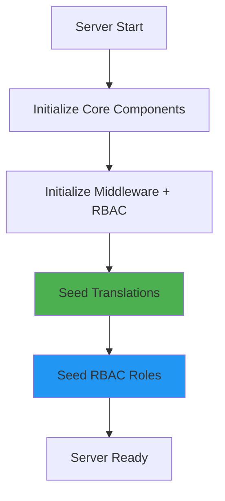

# Data Seeding Guide

This guide explains how to seed initial data in the MasterFabric Serverpod project.

## 🌱 Auto-Seeding on Server Startup

The server automatically seeds essential data on startup:

| Data | Location | Auto-Seed | Manual Trigger |
|------|----------|-----------|----------------|
| **RBAC Roles** | Database | ✅ Yes | `RbacService.seedDefaultRoles()` |
| **Translations** | Database | ✅ Yes | `TranslationService.seedFromAssets()` |
| **App Config** | Database | ❌ No | `serverpod run seed-app-config` |

### Server Startup Logs

```
[INFO] Middleware system initialized with 6 middleware (RBAC enabled)
[INFO] Translations seeded from assets/i18n/ - 4 locale(s)
[INFO] RBAC roles seeded - 4 role(s) created
```

---

## 🛡️ RBAC Roles Seeding

### Automatic Seeding

Default roles are automatically seeded on server startup (only runs once):

```dart
// In server.dart
await _seedRoles(pod);
```

### Default Roles

| Role | Description | Permissions |
|------|-------------|-------------|
| `public` | Unauthenticated access | `read` |
| `user` | Default for all signups | `read`, `write` |
| `moderator` | Content moderation | `read`, `write`, `moderate` |
| `admin` | Full system access | `read`, `write`, `delete`, `moderate`, `manage` |

### Manual Seeding

```dart
// Force re-seed (update existing roles)
final rbacService = RbacService();
await rbacService.seedDefaultRoles(session, force: true);

// Check if seeded
final roles = await rbacService.getAllRoles(session);
print('Available roles: ${roles.map((r) => r.name).toList()}');
```

### User Role Assignment

When a new user registers, they automatically receive the `user` role:

```dart
// This happens automatically via onAfterAccountCreated callback
// In server.dart:
EmailIdpConfigFromPasswords(
  onAfterAccountCreated: _onUserAccountCreated,
)

// Manual assignment
await rbacService.assignRole(session, userId, 'moderator');
```

### Role Configuration (default_roles.dart)

```dart
// lib/src/services/auth/rbac/default_roles.dart
abstract class DefaultRoles {
  static const String public = 'public';
  static const String user = 'user';
  static const String moderator = 'moderator';
  static const String admin = 'admin';
  
  static const String defaultUserRole = user; // Auto-assigned on signup
}

class DefaultRoleConfig {
  static const List<DefaultRoleConfig> defaults = [
    DefaultRoleConfig(
      name: 'admin',
      description: 'Full system access',
      permissions: ['read', 'write', 'delete', 'moderate', 'manage'],
    ),
    // ... other roles
  ];
}
```

---

## 🌍 Translations Seeding

### Automatic Seeding

Translations are auto-seeded from `assets/i18n/*.json` on server startup:

```
assets/i18n/
├── en.i18n.json    # English (default)
├── tr.i18n.json    # Turkish
├── de.i18n.json    # German
└── es.i18n.json    # Spanish
```

### Manual Seeding

```dart
final translationService = TranslationService();
final count = await translationService.seedFromAssets(session);
print('Seeded $count locale(s)');
```

### Translation File Format

```json
{
  "welcome": {
    "title": "Welcome, {name}!",
    "subtitle": "We're glad to have you here"
  },
  "common": {
    "save": "Save",
    "cancel": "Cancel"
  }
}
```

See [README_TRANSLATIONS.md](README_TRANSLATIONS.md) for detailed translation guide.

---

## ⚙️ App Config Seeding

App Config is NOT auto-seeded. Use one of the methods below:

### Quick Start (Recommended)

```bash
# Using Serverpod script command
serverpod run seed-app-config

# Or directly
bash scripts/seed_app_config.sh

# Windows PowerShell
powershell -ExecutionPolicy Bypass -File scripts\seed_app_config.ps1
```

The script will:
- ✅ Check if PostgreSQL container is running
- ✅ Start it if needed
- ✅ Execute the seed SQL file
- ✅ Verify the seeded data

### Option 1: Direct SQL Injection

```bash
# Using psql command line
psql -U serverpod -d serverpod -f migrations/seed_app_config.sql

# Using docker-compose
docker-compose exec postgres psql -U serverpod -d serverpod -f /path/to/migrations/seed_app_config.sql
```

### Option 2: Using Docker Compose

```bash
docker-compose exec postgres psql -U serverpod -d serverpod -c "$(cat migrations/seed_app_config.sql)"
```

### Option 3: Using Dart Script

```bash
# Run the seeding script
dart bin/seed_app_config.dart

# Clear existing data and reseed
dart bin/seed_app_config.dart --clear

# Seed only specific environment
dart bin/seed_app_config.dart --environment=production
```

### What Gets Seeded

| Environment | Debug Mode | API URL | Analytics | Encryption |
|-------------|------------|---------|-----------|------------|
| Development | ✅ | http://localhost:8080 | ❌ | ❌ |
| Staging | ❌ | https://staging-api.example.com | ❌ | ❌ |
| Production | ❌ | https://api.example.com | ✅ | ✅ |

### Verifying Seed Data

```sql
SELECT 
    "environment",
    "platform",
    "isActive",
    "createdAt"
FROM "app_config_entry"
ORDER BY "environment", "platform";
```

---

## 🔄 Seeding Order

The server seeds data in this order:



### In `server.dart`:

```dart
void run(List<String> args) async {
  // 1. Initialize Serverpod
  final pod = Serverpod(...);
  
  // 2. Initialize Auth Services
  pod.initializeAuthServices(...);
  
  // 3. Initialize Core Components (includes Middleware + RBAC)
  await _initializeCoreComponents(pod);
  
  // 4. Seed Translations
  await _seedTranslations(pod);
  
  // 5. Seed RBAC Roles
  await _seedRoles(pod);
  
  // 6. Start Server
  await pod.start();
}
```

---

## 🧪 Testing Seeded Data

### Check RBAC Roles

```dart
// Via endpoint
final roles = await client.rbac.getAllRoles();
print('Available roles: $roles');

// Via database
SELECT * FROM "role" ORDER BY "name";
```

### Check Translations

```dart
// Via endpoint
final translations = await client.translation.getTranslations(locale: 'en');
print('English translations: ${translations.length} keys');

// Via database
SELECT "locale", COUNT(*) as count 
FROM "translation" 
GROUP BY "locale";
```

### Check User Roles

```dart
// Via endpoint
final userRoles = await client.rbac.getUserRoles(userId);
print('User roles: $userRoles');

// Via database
SELECT u."userId", r."name" as role
FROM "user_role" u
JOIN "role" r ON u."roleId" = r."id";
```

---

## 🔧 Customization

### Adding New Default Roles

Edit `lib/src/services/auth/rbac/default_roles.dart`:

```dart
class DefaultRoleConfig {
  static const List<DefaultRoleConfig> defaults = [
    // Existing roles...
    
    // Add new role
    DefaultRoleConfig(
      name: 'editor',
      description: 'Content editor',
      permissions: ['read', 'write', 'publish'],
      isActive: true,
    ),
  ];
}
```

### Adding New Translations

Create or edit `assets/i18n/{locale}.i18n.json`:

```json
{
  "new_feature": {
    "title": "New Feature",
    "description": "This is a new feature"
  }
}
```

Translations will be seeded on next server restart.

### Forcing Re-Seed

```dart
// Force re-seed roles (updates existing)
await rbacService.seedDefaultRoles(session, force: true);

// Translations are always updated if files changed
await translationService.seedFromAssets(session);
```

---

## 📚 Related Documentation

- [README_TRANSLATIONS.md](README_TRANSLATIONS.md) - Detailed translation guide
- [Main README](../README.md) - Project overview
- [Serverpod Documentation](https://docs.serverpod.dev)
